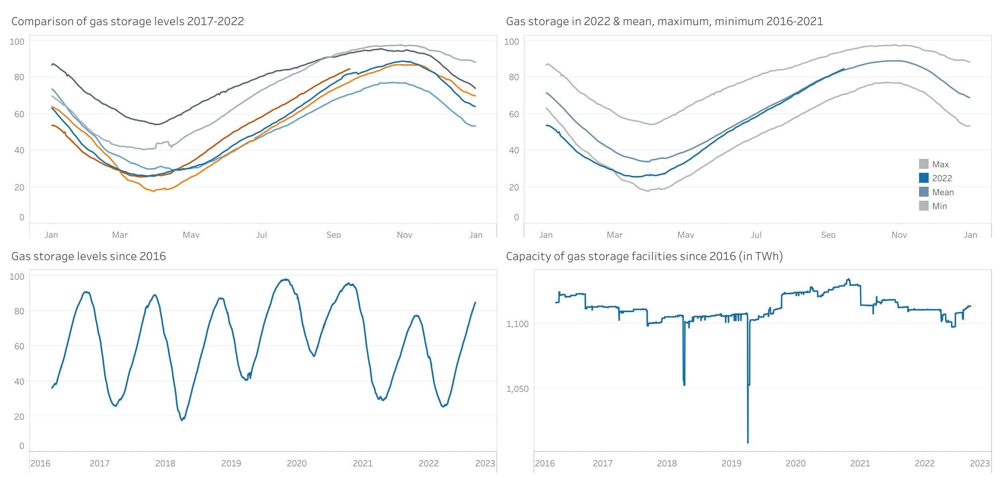

# Level of EU gas storage facilities
By Deniz Firat  
September, 2022

# Introduction
Winter is just around the corner in the EU, and people are worried about gas storage due to the current situation. The gas storage facilities serve as a buffer for the gas market and are intended to compensate for fluctuations in gas consumption. At the beginning of the heating period in the fall, they are usually well filled. On particularly cold days in winter, up to 60 percent of gas consumption is covered by the storage facilities. I have evaluated and visualized the data of the gas storage levels since 2016 so that one can quickly get an up-to-date picture of the situation.

# Process
For data cleaning and analysis, I used RStudio, an integrated development environment for R. The exact procedure can be viewed [here](https://github.com/dfirat/eu-gas-storage/blob/main/eu-gas-storage.md).
I used Tableau to visualize the results, which can be viewed [here](https://public.tableau.com/app/profile/dfirat/viz/LevelofEUgasstoragefacilities/Dashboard).

# Results
Since the spring, there has been a requirement in the EU that gas storage facilities must be 80 percent full by November 1. Although gas supplies from Russia have fallen significantly, the above target was reached on August 29. It is also worth highlighting that they are currently being filled at a slightly faster rate than the 2016-2021 average.

Source: GIE AGSI. Data last updated: September 14, 2022